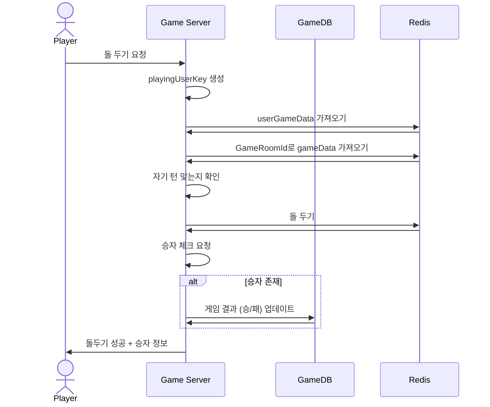
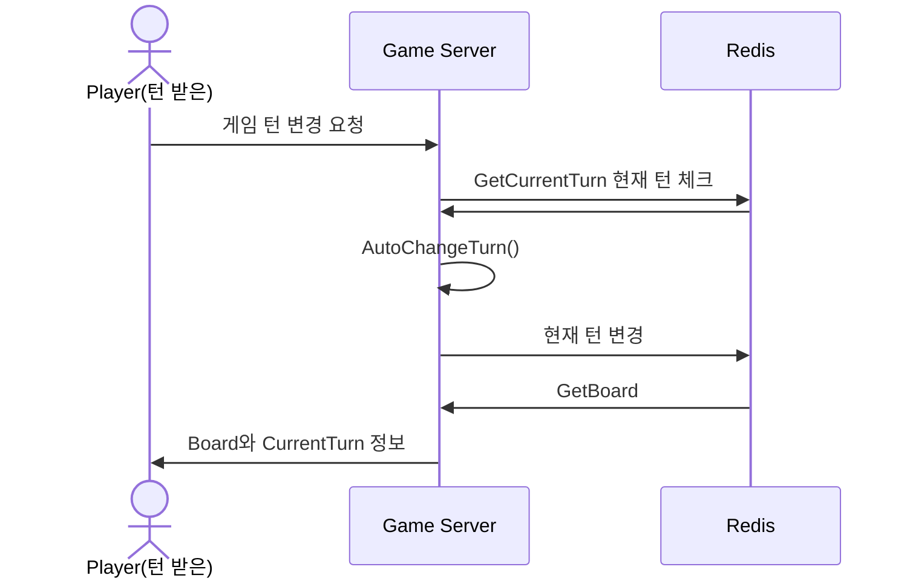
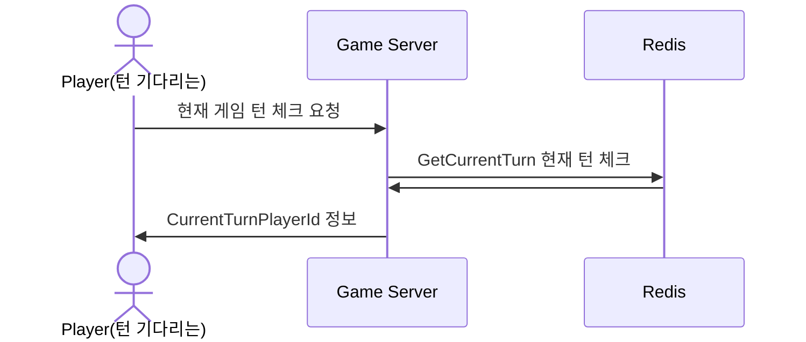
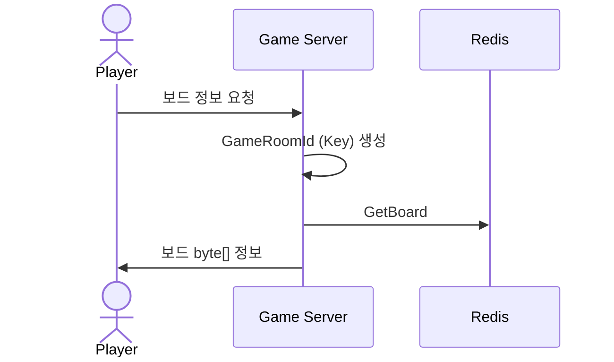

# 시퀀스 다이어그램 (GamePlay)
------------------------------
## Put Omok
### : 돌두기 (자기 차례 플레이어)

------------------------------

## Giveup Put Omok 
### : 돌두기 포기 요청 (자기 차례 플레이어)

------------------------------

## Turn Checking 
### : 현재 턴 상태 요청 (차례 대기 플레이어)

------------------------------

## OmokGameData 
### : 게임 데이터 가져오는 요청 (보드정보 + 플레이어 등등)

