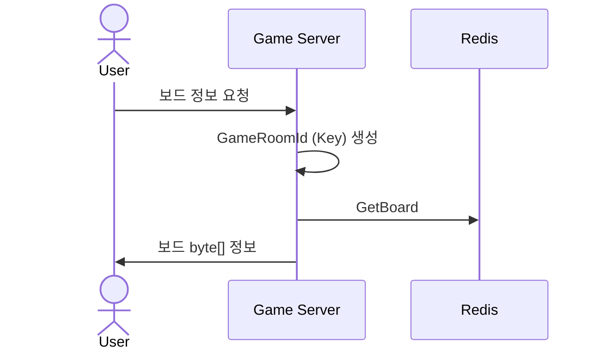
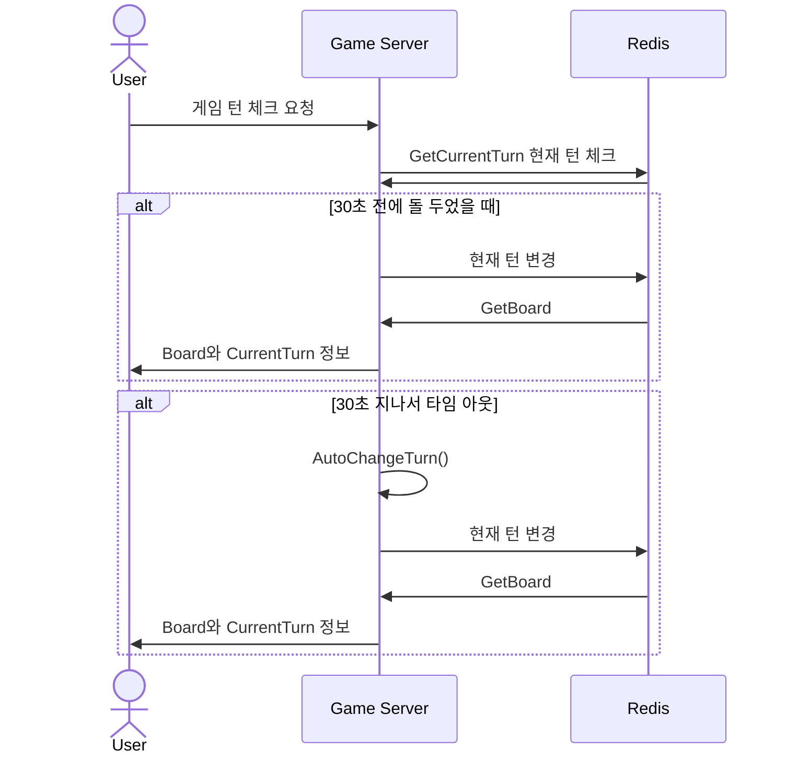
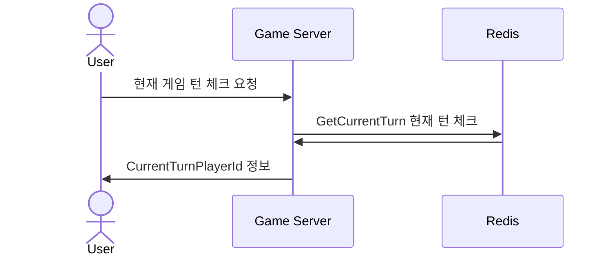
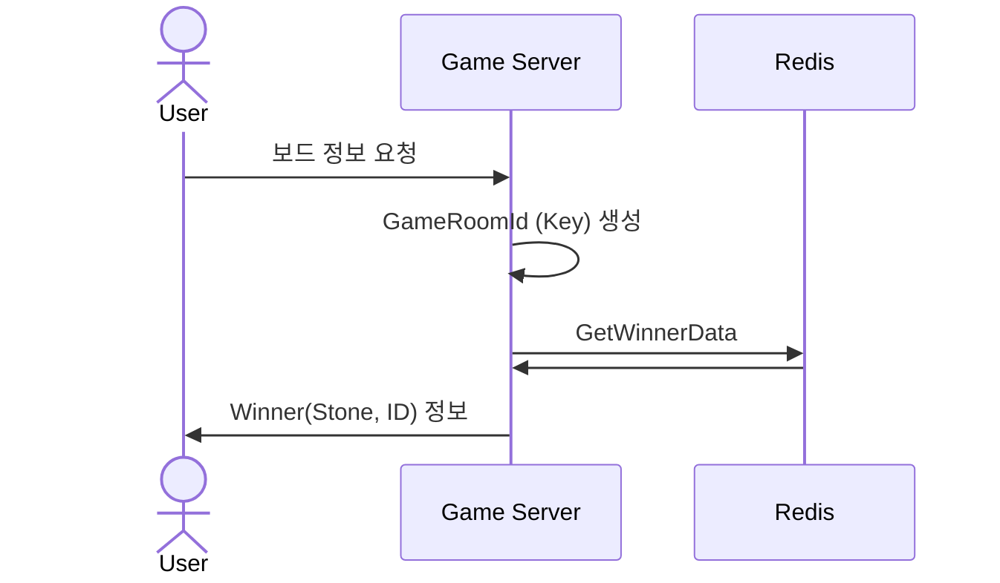

# 시퀀스 다이어그램
## GetGameInfo

## 오목 보드 가져오기 
### POST GetGameInfo/board

## 30초 턴 체크 (Long Polling)
### POST GetGameInfo/WaitForTurnChange

## 현재 게임 턴 체크 (Polling)
### POST GetGameInfo/turnplayer

## 승자 정보 가져오기
### POST GetGameInfo/winner

