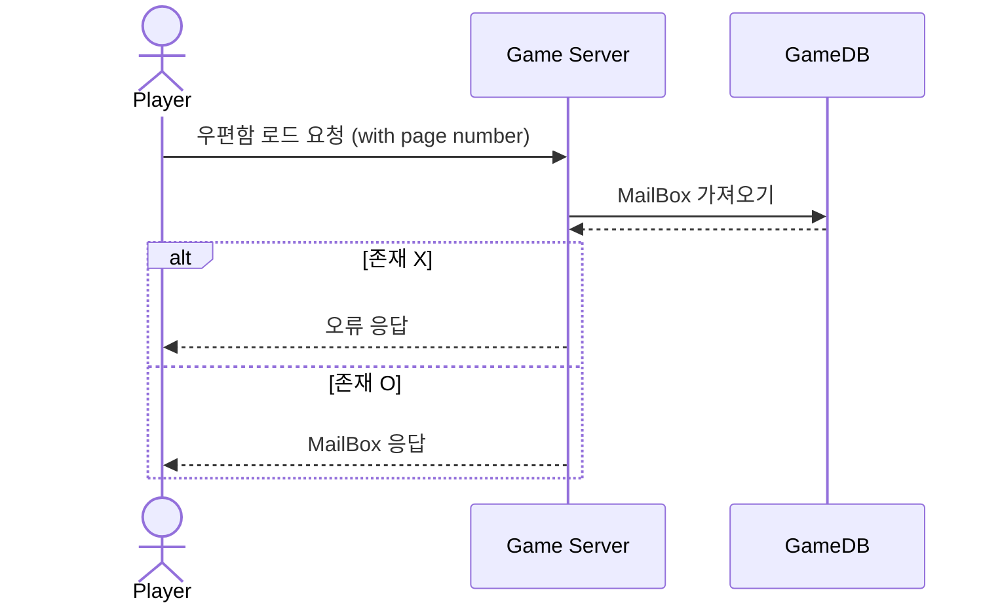
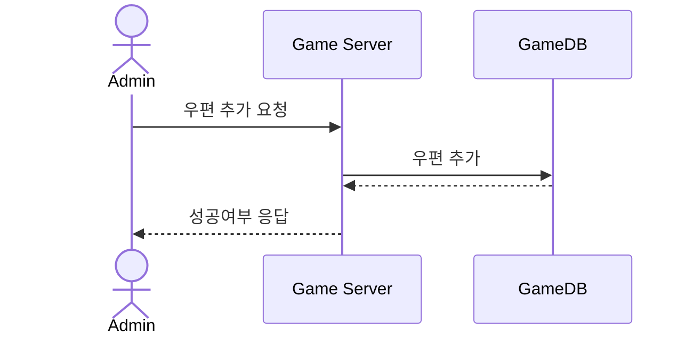
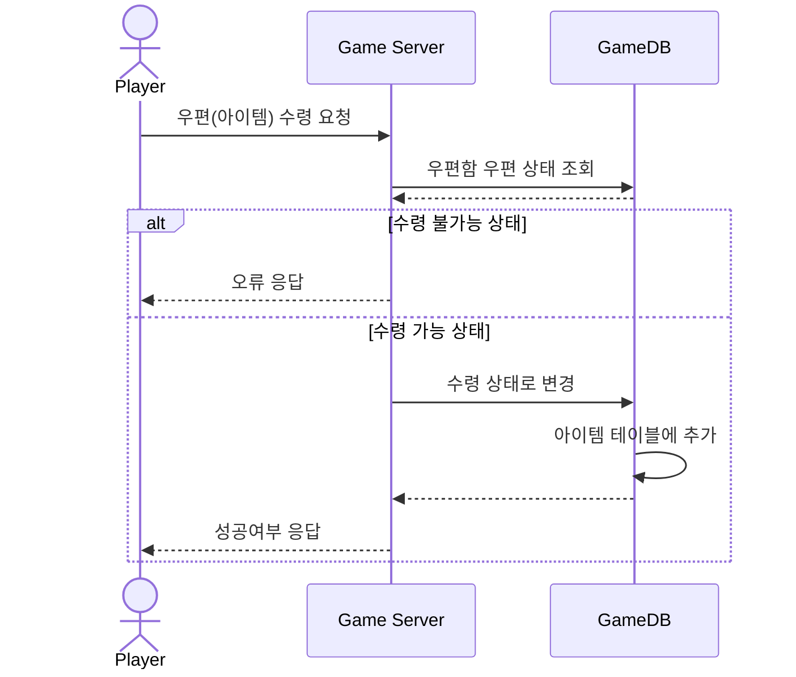

# 시퀀스 다이어그램 (MailBox)

------------------------------

## Get Player MailBox
### : 플레이어의 우편함을 가져오는 요청 /mail/get-mailbox

------------------------------

## Add Mail
### : 플레이어의 우편함에 우편을 넣는 요청 /mail/add

------------------------------

## Receive Mail
### : 플레이어가 자신의 우편함에서 우편을 수령하는 요청 /mail/receive

------------------------------
