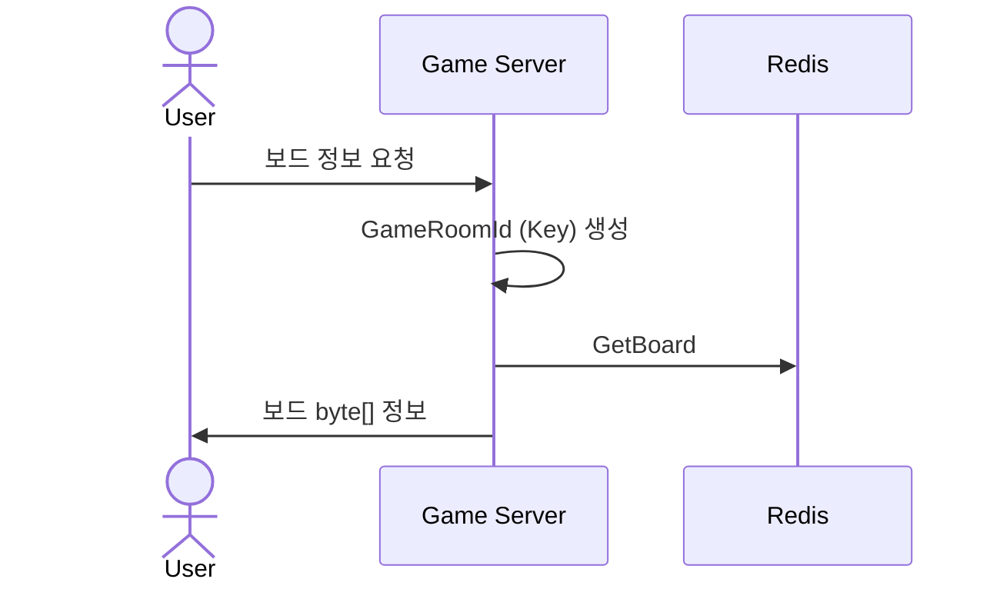
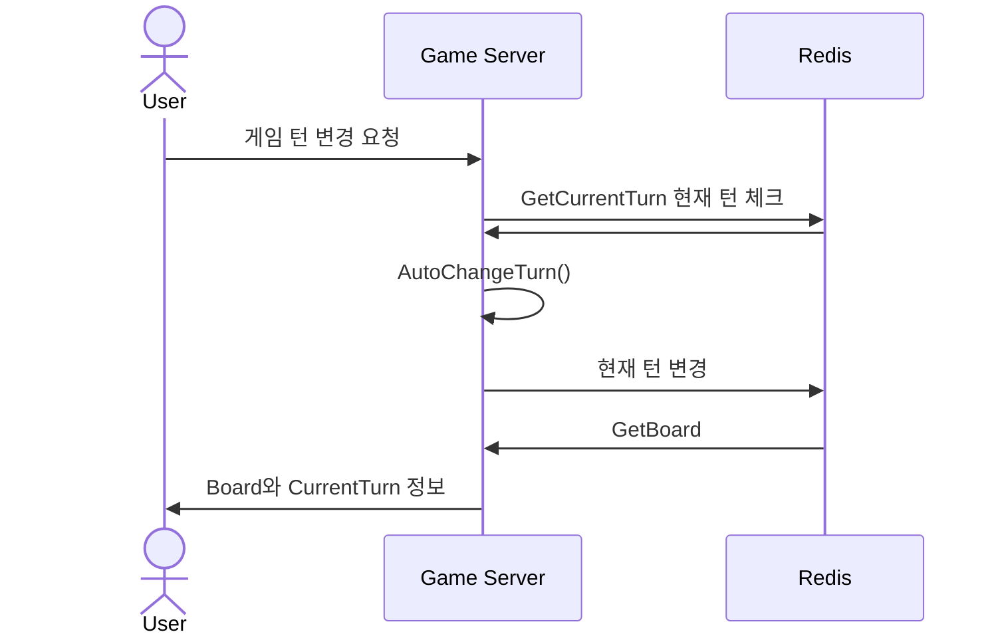
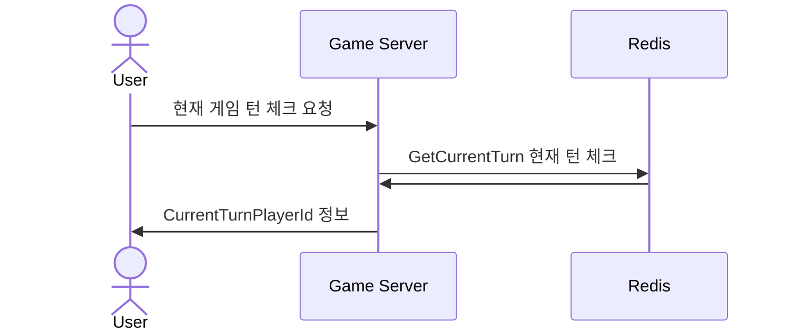
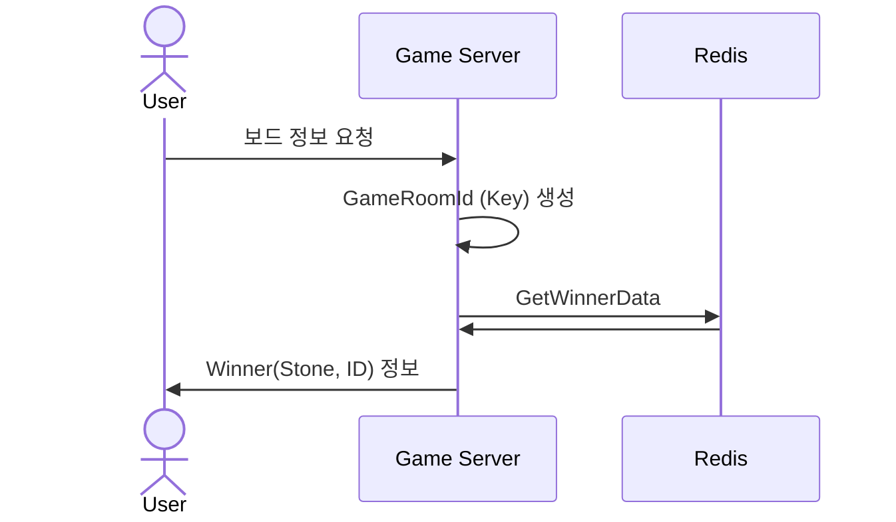

# 시퀀스 다이어그램
## OmokGamePlay

## 오목 보드 가져오기 
### POST OmokGamePlay/board

## 30초 지나면 호출되는, 턴 바꾸기 (Long Polling)
### POST OmokGamePlay/turn-change

## 1초마다 호출되는, 현재 게임 턴 체크 (Polling)
### POST OmokGamePlay/current-turn-player

## 승자 정보 가져오기
### POST turn-change/winner

