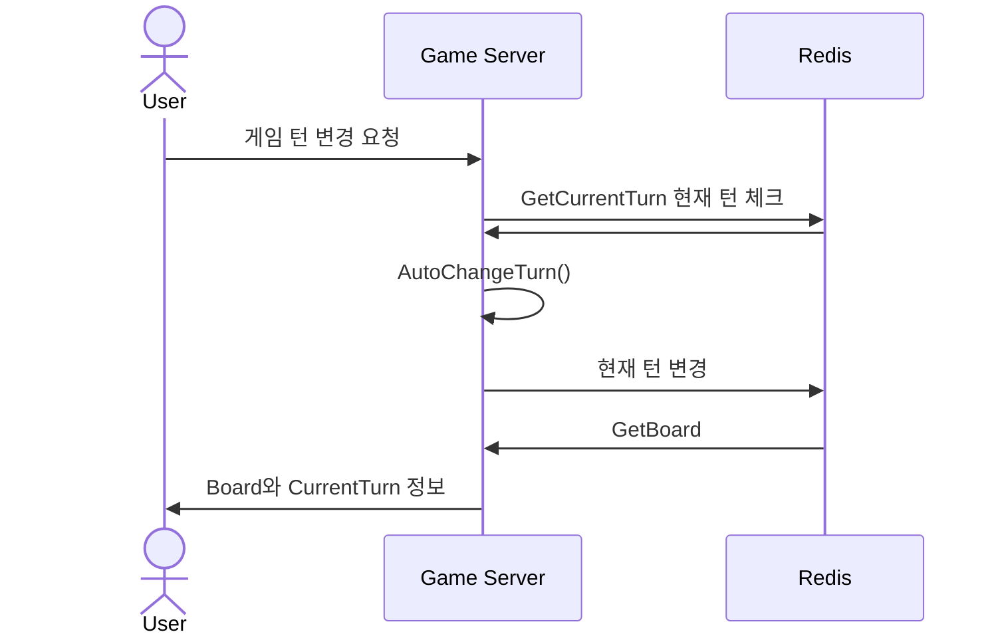
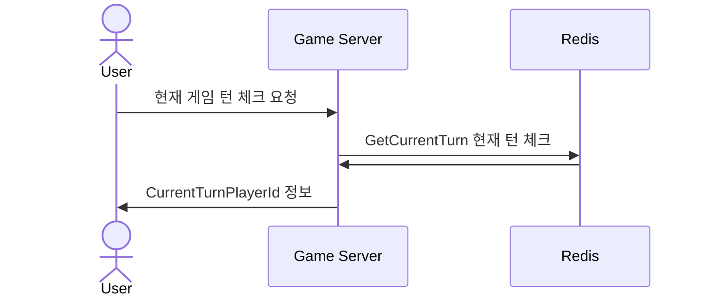
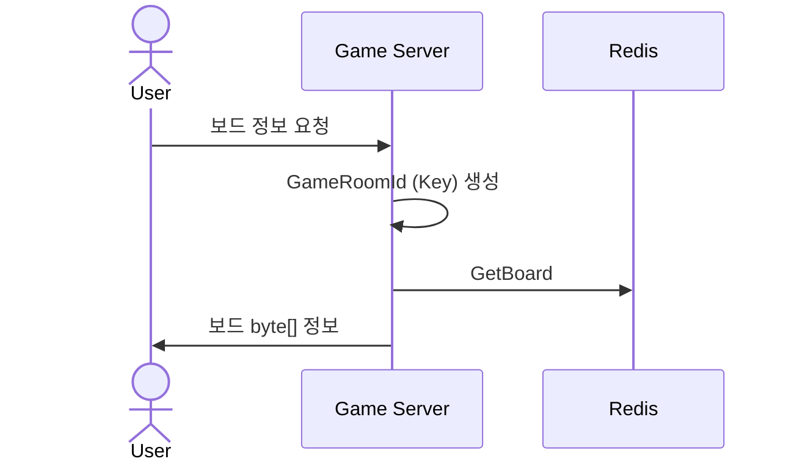
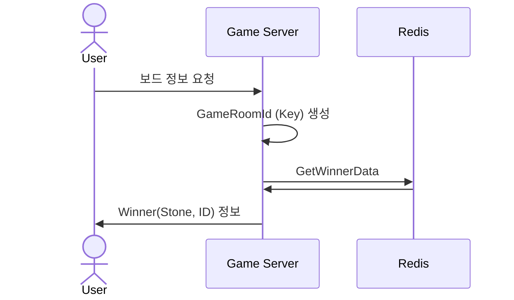

# 시퀀스 다이어그램 (OmokGamePlay)

------------------------------

## POST OmokGamePlay/turn-change
### : 30초 지나면 호출되는, 턴 바꾸기 (Long Polling) 


```css
public class PlayerRequest
{
    public string PlayerId { get; set; }
}

public class TurnChangeResponse
{
    public ErrorCode Result { get; set; }
    public GameInfo GameInfo { get; set; }
}
```

------------------------------

## POST OmokGamePlay/turn-checking
### : 1초마다 호출되는, 현재 게임 턴 체크 (Polling)



```css
public class PlayerRequest
{
    public string PlayerId { get; set; }
}

public class PlayerResponse
{
    public ErrorCode Result { get; set; }
    public string PlayerId { get; set; }
}
```

------------------------------


## POST OmokGamePlay/board
### : 오목 보드 가져오기 


```css
public class PlayerRequest
{
    public string PlayerId { get; set; }
}

public class BoardResponse
{
    public ErrorCode Result { get; set; }
    public byte[] Board { get; set; }
}
```


------------------------------


## POST turn-change/winner
### : 승자 정보 가져오기


```css
public class PlayerRequest
{
    public string PlayerId { get; set; }
}

public class WinnerResponse
{
    public ErrorCode Result { get; set; }
    public Winner Winner { get; set; }
}

public class Winner
{
    public OmokStone Stone { get; set; }
    public string PlayerId { get; set; }
}
```


