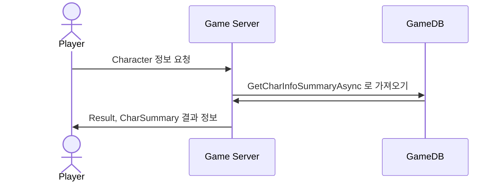
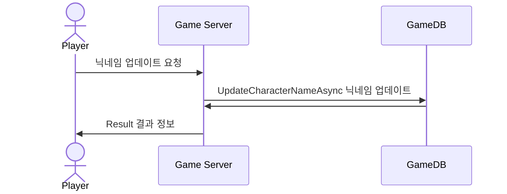

# 시퀀스 다이어그램 (PlayerInfo)

------------------------------
------------------------------

## Basic Player Data
### : 플레이어 기본 데이터 가져오는 요청 (닉네임, 레벨, 경험치, 승, 패, 무)

------------------------------

## Update NickName
### : 닉네임 변경 요청

------------------------------

