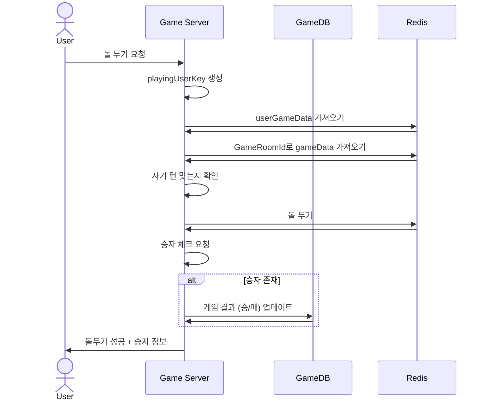

# 시퀀스 다이어그램
## PutOmok

## 오목 돌 두기
### POST PutOmok



```css
public class PutOmokRequest
{
    [Required] public string PlayerId { get; set; }
    [Required] public int X { get; set; }
    [Required] public int Y { get; set; }
}
```

```css
public class PutOmokResponse
{
    [Required] public ErrorCode Result { get; set; } = ErrorCode.None;
    public Winner Winner { get; set; }
}
```
