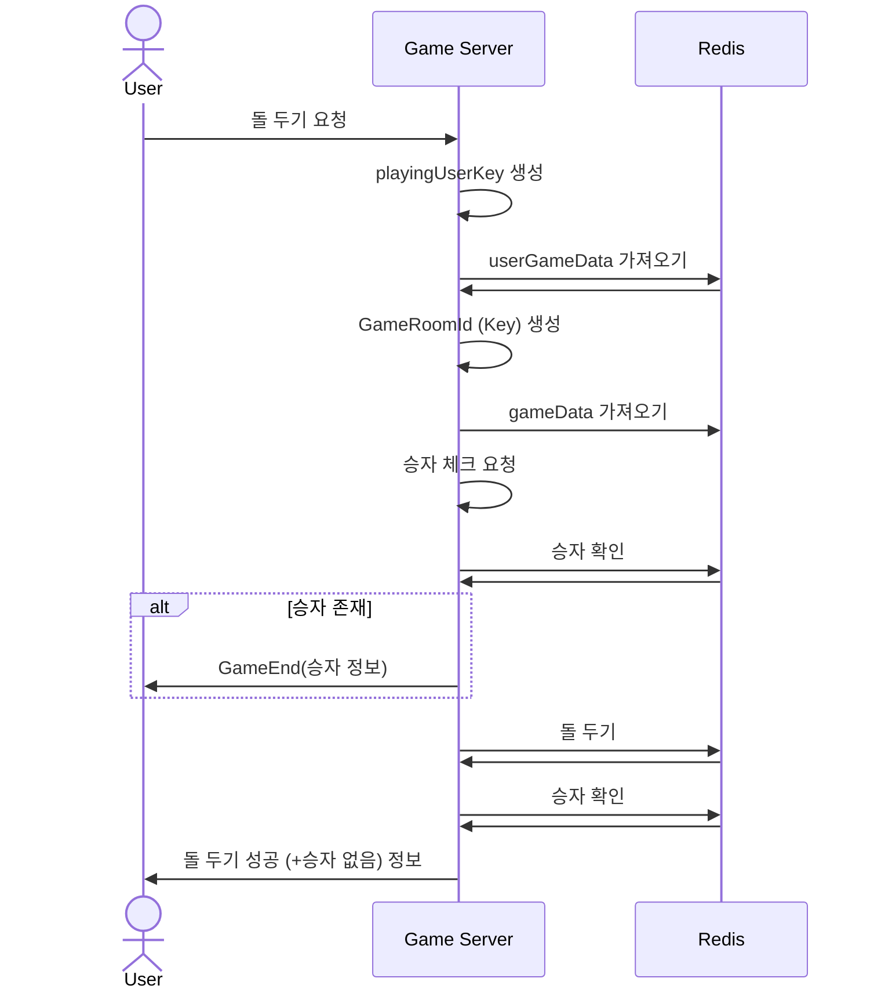

# 시퀀스 다이어그램
## PutOmok

## 오목 돌 두기
### POST PutOmok

```mermaid
sequenceDiagram
	actor User
	participant Game Server
  participant Redis

	User ->> Game Server: 돌 두기 요청
	Game Server ->> Game Server : playingUserKey 생성
  Game Server ->> Redis : userGameData 가져오기
	Redis ->> Game Server :  
	Game Server ->> Game Server : GameRoomId (Key) 생성
  Game Server ->> Redis : gameData 가져오기
  Game Server ->> Game Server : 승자 체크 요청
  Game Server ->> Redis : 승자 확인
	Redis ->> Game Server :  
 alt 승자 존재
  Game Server ->> User : GameEnd(승자 정보)
 end
  Game Server ->> Redis : 돌 두기
  Redis ->> Game Server : 
  Game Server ->> Redis : 승자 확인
  Redis ->> Game Server :  
  Game Server ->> User : 돌 두기 성공 (+승자 없음) 정보

```
