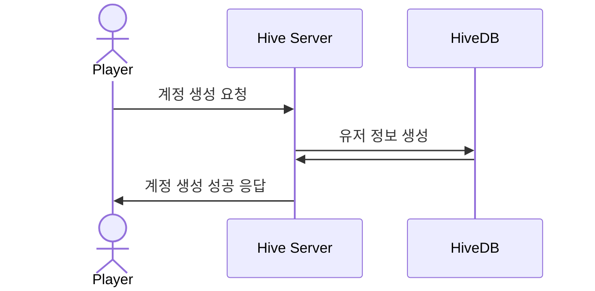
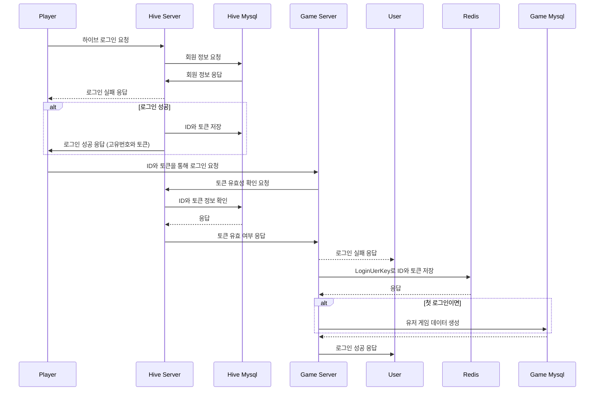

# 시퀀스 다이어그램 (Register-Login)
## Register 
### : 계정 생성

```mermaid
sequenceDiagram
	actor P as Player
	participant H as Hive Server
	participant HD as HiveDB

	P ->> H: 계정 생성 요청
	H ->> HD : 유저 정보 생성
	HD ->> H : 
  	H ->> P: 계정 생성 성공 응답
```

## Login 
### : 로그인

```mermaid
sequenceDiagram
	
	
	Player ->> Hive Server: 하이브 로그인 요청
  Hive Server ->> Hive Mysql : 회원 정보 요청
  Hive Mysql ->> Hive Server : 회원 정보 응답
	Hive Server -->> Player : 로그인 실패 응답

  alt 로그인 성공
  Hive Server ->> Hive Mysql : ID와 토큰 저장
  Hive Server ->> Player : 로그인 성공 응답 (고유번호와 토큰)
  end

	Player ->> Game Server : ID와 토큰을 통해 로그인 요청
	Game Server ->> Hive Server : 토큰 유효성 확인 요청
	Hive Server ->> Hive Mysql : ID와 토큰 정보 확인
	Hive Mysql -->> Hive Server : 응답
	Hive Server ->> Game Server : 토큰 유효 여부 응답

	Game Server -->> User : 로그인 실패 응답
	
	Game Server ->> Redis : LoginUerKey로 ID와 토큰 저장
  Redis -->> Game Server : 응답

	alt 첫 로그인이면
	Game Server ->> Game Mysql : 유저 게임 데이터 생성
	end
	Game Mysql -->> Game Server :  

	Game Server ->> User : 로그인 성공 응답 
	


```
