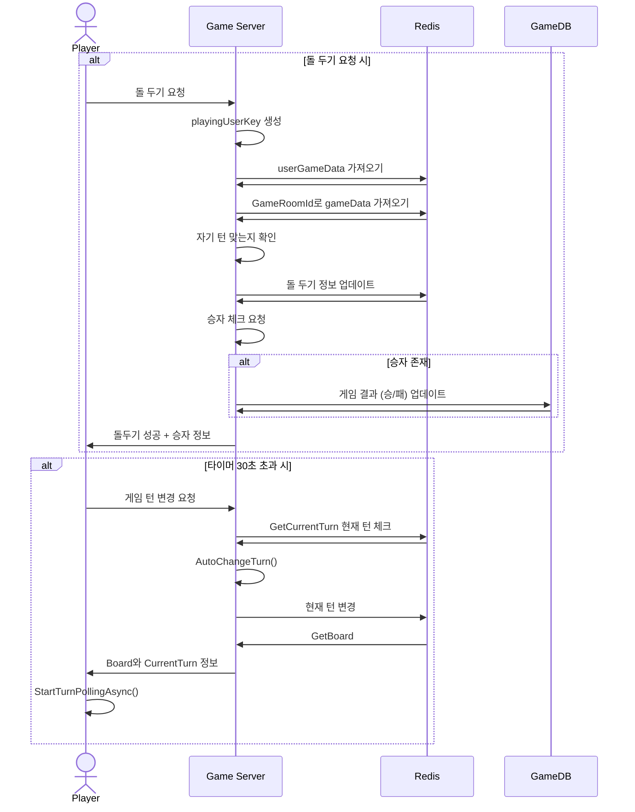
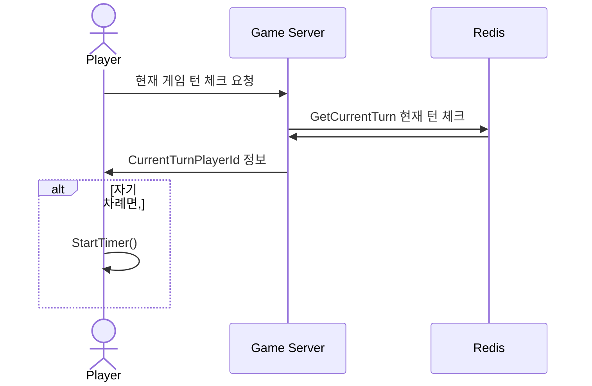
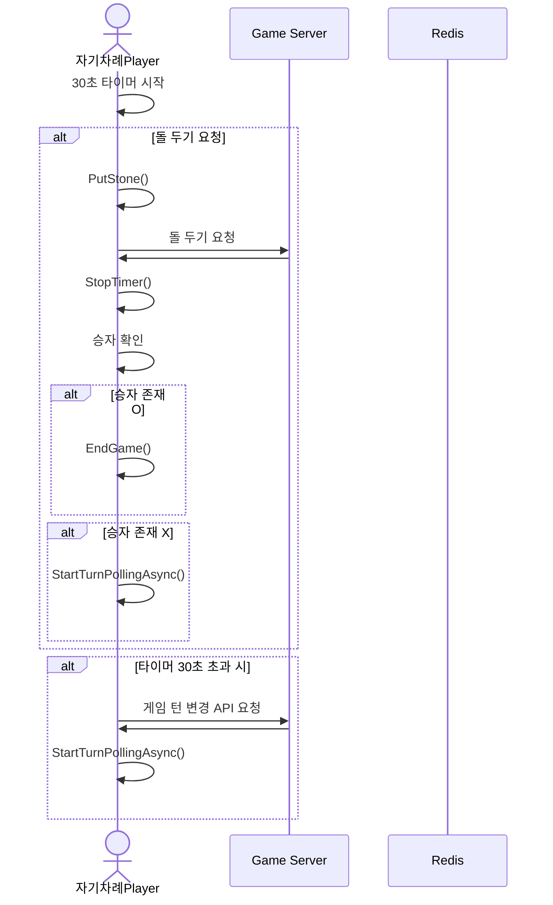
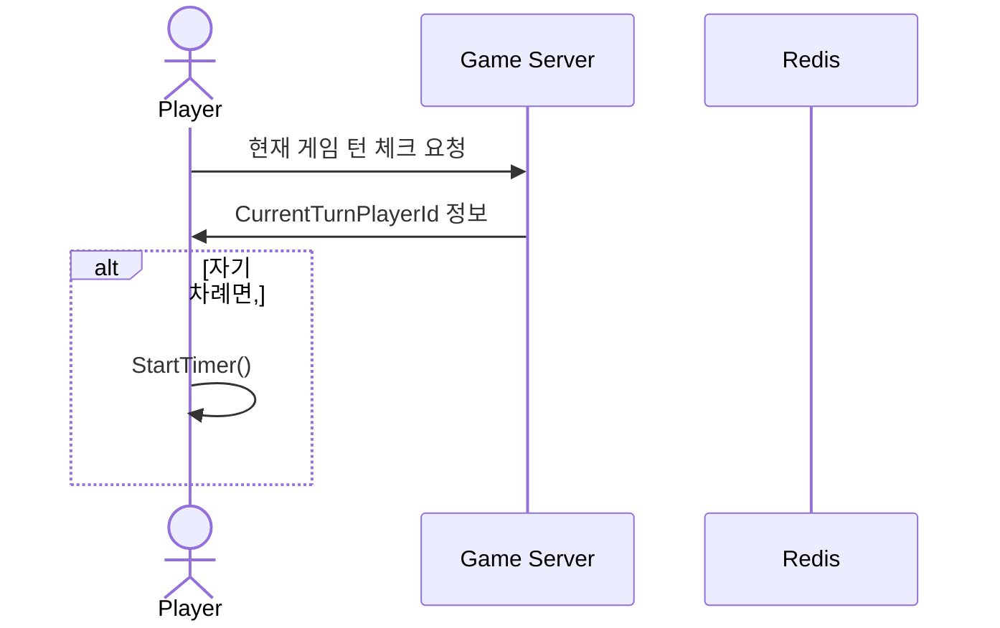

# 시퀀스 다이어그램 

------------------------------

## 오목 게임 중 (자기 차례인 플레이어)
### : 클라이언트에서 StartTimer() 실행 중

------------------------------

## 오목 게임 중 (차례 기다리는 플레이어)
### : StartTurnPollingAsync()

------------------------------
------------------------------

## 오목 게임 중 (자기 차례인 플레이어)
### : 클라이언트에서 StartTimer() 실행 중

------------------------------

## 오목 게임 중 (차례 기다리는 플레이어)
### : StartTurnPollingAsync()

