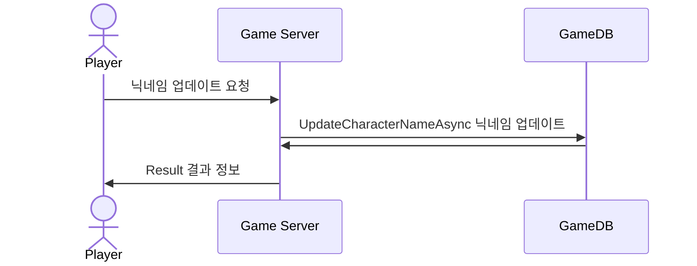
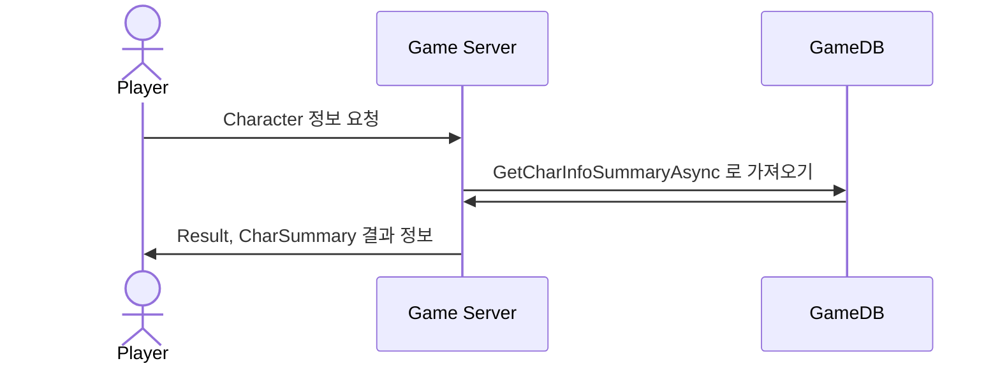

# 시퀀스 다이어그램 (Character)

------------------------------

## POST Character/updatename
### : CharName(닉네임) 업데이트


```css
public class UpdateCharacterNameRequest
{
    public string PlayerId { get; set; }
    public string CharName { get; set; }
}

public class UpdateCharacterNameResponse
{
    public ErrorCode Result { get; set; }
}

```

------------------------------

## POST Character/getinfo
### : Character 정보를 가져오는 요청



```css
public class CharacterSummaryRequest
{
    public string PlayerId { get; set; }
}

public class CharacterSummaryResponse
{
    public ErrorCode Result { get; set; }
    public CharSummary CharSummary { get; set; }
}

public class CharSummary
{
    public string CharName { get; set; }
    public int Exp { get; set; }
    public int Level { get; set; }
    public int Win { get; set; }
    public int Lose { get; set; }
    public int Draw { get; set; }
}

```

------------------------------

